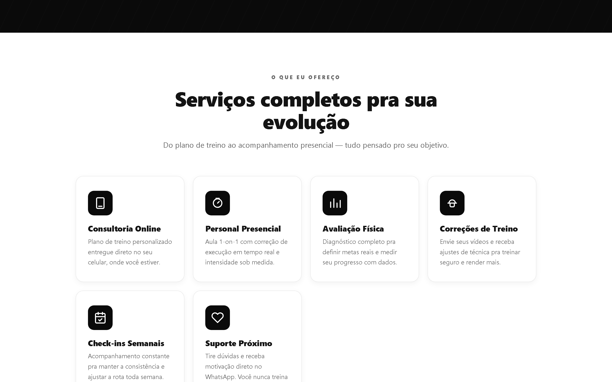
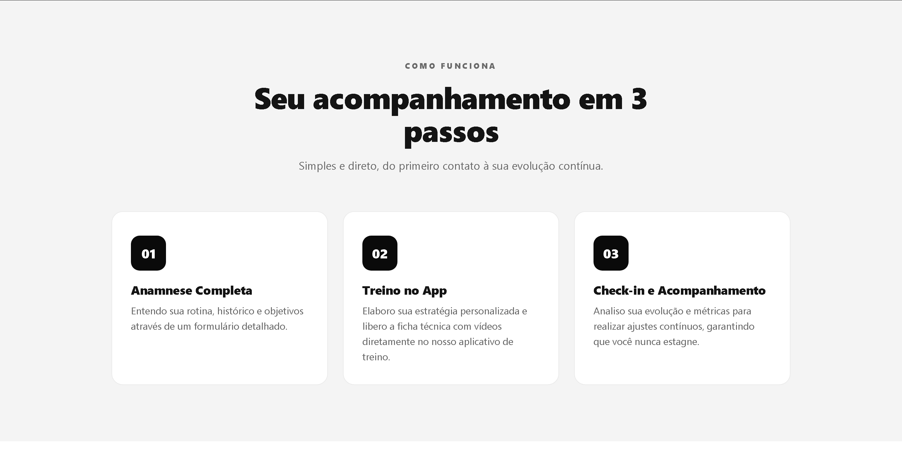
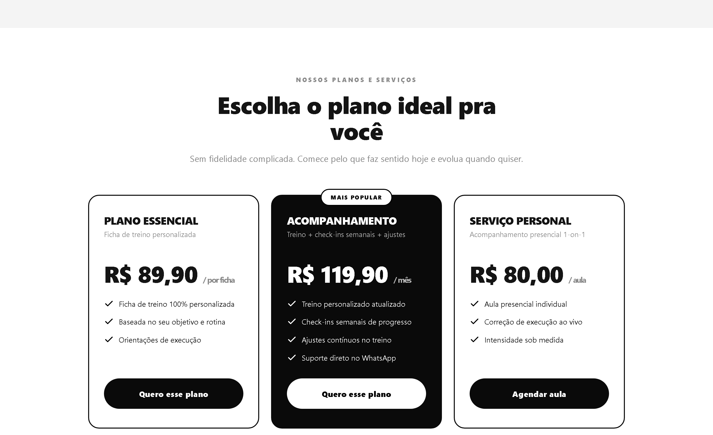
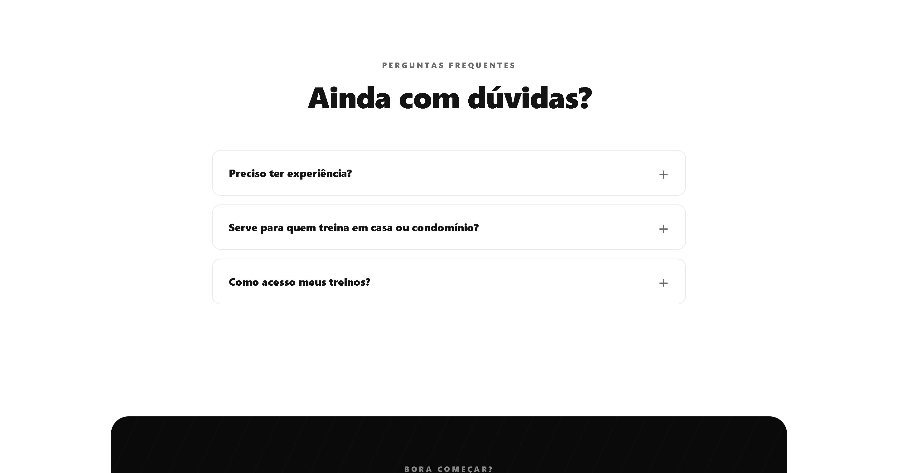

<div align="center">


# Mateus Aguiar — Personal Trainer & Consultoria

**Landing page institucional de alta conversão para um personal trainer** — construída do zero em HTML, CSS e JavaScript puro, sem frameworks nem dependências.

[](https://mrguerreiro.github.io/mateus-aguiar-personal/)
[_99801--7399-25D366?style=for-the-badge&logo=whatsapp&logoColor=white)](https://wa.me/5514998017399)


</div>

---

## 🎯 Sobre o projeto

Site de **página única, rápido e 100% estático**, com identidade visual preto & branco alinhada à marca. O foco é claro: **transformar visitantes em contatos no WhatsApp**. Cada botão abre a conversa com uma mensagem pré-preenchida — e nos planos, a mensagem já vem personalizada.

**🔗 Acesse:** <https://mrguerreiro.github.io/mateus-aguiar-personal/>

---

## ⭐ Destaques técnicos

Este projeto foi construído com **cuidado de produção**, não apenas "um site bonito". Abaixo, o que o diferencia:

### 🛡️ Robustez & Progressive Enhancement
- **Funciona mesmo sem JavaScript** — o conteúdo é sempre visível; as animações são um *enhancement* opcional (ativadas via classe `.js`).
- **Links de WhatsApp reais no HTML** — o CTA principal funciona mesmo se o JS falhar; o script apenas personaliza a mensagem por plano.
- **FAQ com `<details>` nativo** — abre e fecha sem uma linha de JavaScript.
- Respeita **`prefers-reduced-motion`** — desativa animações para quem tem sensibilidade a movimento.

### ♿ Acessibilidade (WCAG AA)
- HTML **semântico** (`header`, `nav`, `section`, `footer`) e hierarquia correta de headings.
- Menu mobile com **`aria-expanded` / `aria-controls`** e rótulos dinâmicos.
- SVGs decorativos marcados com **`aria-hidden`**; imagens com **`alt`** descritivo.
- **Contraste de cores** ajustado para atender o mínimo AA (4.5:1).

### 🔍 SEO
- **Dados estruturados JSON-LD** (`LocalBusiness`) com telefone, preços e serviços — otimizado para **busca local no Google**.
- **Open Graph** + Twitter Card (prévia rica ao compartilhar), `canonical` e `favicon`.
- `meta description`, `lang` e URLs semânticas.

### 🔒 Segurança
- **Content-Security-Policy** restritiva — bloqueia qualquer script/recurso externo.
- `referrer-policy` e **`rel="noopener"`** em todos os links externos.
- Branch `master` protegida contra *force-push* e exclusão.

### ⚡ Performance
- **Zero dependências** e **zero requisições externas** — carrega instantaneamente.
- CSS e JS *inline* (sem round-trips extras); SVGs reutilizados via `<use>`.
- Imagem principal (LCP) otimizada com **`fetchpriority="high"`**; demais com **`loading="lazy"`**.

### 📱 Responsividade
- Layout fluido com **`clamp()`** e **CSS Grid**, testado de **360px (celular) a telões**.
- Verificado com auditoria automática de *overflow* (nenhum elemento estoura a viewport).

---

## 📸 Telas

<div align="center">

### 💻 Desktop


<table>
  <tr>
    <td width="50%"></td>
    <td width="50%"></td>
  </tr>
  <tr>
    <td width="50%"></td>
    <td width="50%"></td>
  </tr>
</table>

### 📱 Mobile


</div>

---

## 🛠️ Stack

| Camada      | Tecnologia                              |
|-------------|-----------------------------------------|
| Marcação    | HTML5 semântico                         |
| Estilo      | CSS3 (Grid, Flexbox, `clamp()`, variáveis) |
| Interação   | JavaScript (Vanilla, IntersectionObserver) |
| Hospedagem  | GitHub Pages                            |
| Dependências| **Nenhuma**                             |

---

## 📁 Estrutura

```
.
├── index.html              Página completa (HTML + CSS + JS inline)
├── assets/
│   ├── logo.jpeg           Logo da marca
│   └── mateus.jpg          Foto do personal
├── docs/screenshots/       Imagens deste README
├── .nojekyll               Evita processamento Jekyll no GitHub Pages
└── README.md
```

---

## ✏️ Como editar

| O que mudar        | Onde                                                                 |
|--------------------|----------------------------------------------------------------------|
| Preços / planos    | Seção `#planos` no `index.html`                                       |
| Textos / serviços  | Direto no `index.html`                                                |
| Nº do WhatsApp     | Variável `WA_NUMBER` no bloco `<script>` (formato `55` + DDD + número) |
| Mensagem padrão    | Variável `WA_MSG_DEFAULT` no `<script>`                              |
| Logo / foto        | Substitua os arquivos em `assets/` mantendo os mesmos nomes           |

### Publicar alterações

```bash
git add -A
git commit -m "descreva a mudança"
git push
```

O GitHub Pages reconstrói o site automaticamente em ~1 minuto.

---

## 💬 Contato

<div align="center">

[](https://wa.me/5514998017399?text=Ol%C3%A1%2C%20gostaria%20de%20saber%20mais%20a%20respeito%20dos%20planos%20e%20servi%C3%A7os.)

**(14) 99801-7399**

</div>
